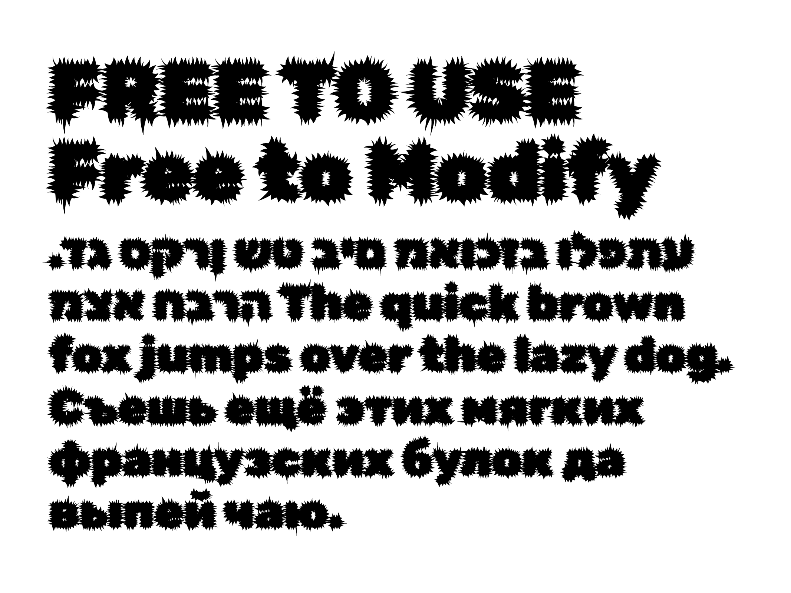

# Rubik-Filtered

Rubik *Filtered* Fonts are original, script-generated design based on the GoogleFont [Rubik](https://github.com/googlefonts/Rubik) by [Hubert & Fischer](https://hubertfischer.com/), [Meir Sadan](https://meirsadan.com/) and [Cyreal](http://www.cyreal.org/). The code used to generate it can be found at [https://github.com/NaN-xyz/Glyph-Filters](https://github.com/NaN-xyz/Glyph-Filters).

More samples can be found at [generativefonts.xyz](https://www.generativefonts.xyz/)

``+-+-+-+-+-+-+-+
|B|E|A|S|T|L|Y|
+-+-+-+-+-+-+-+  ``

## License

This Font Software is licensed under the SIL Open Font License, Version 1.1.
This license is copied below, and is also available with a FAQ at
https://scripts.sil.org/OFL
